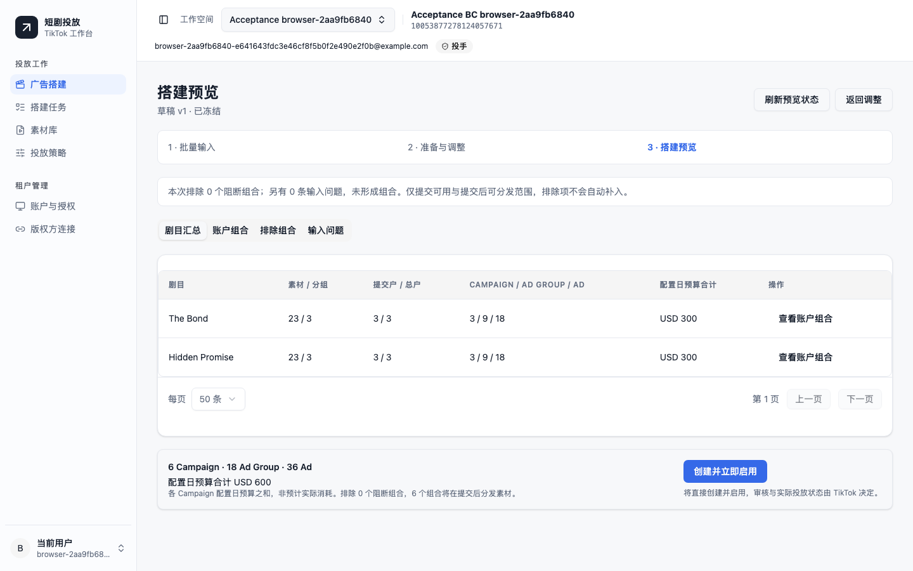
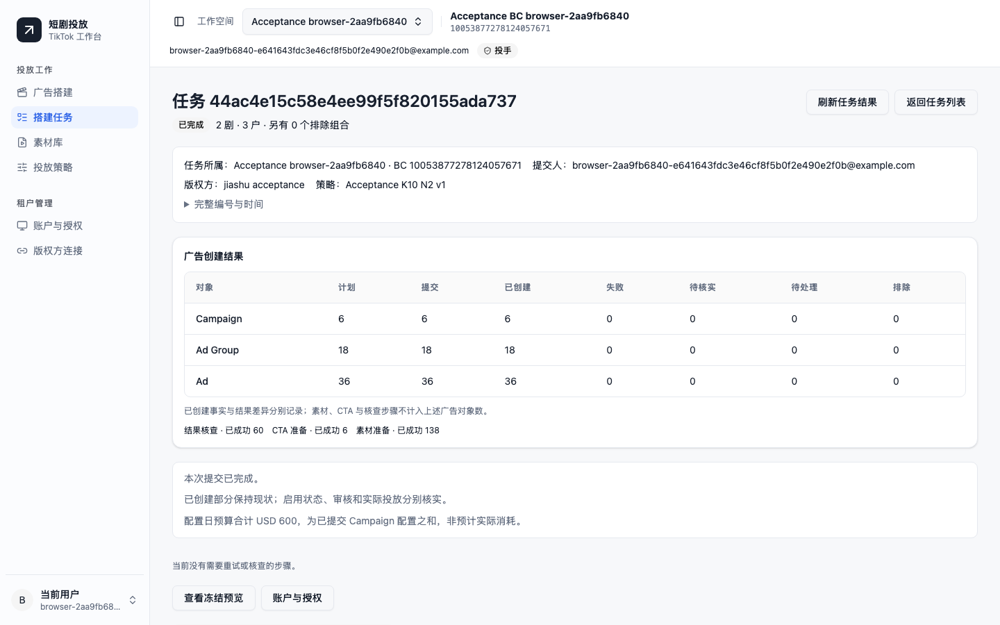

# 功能与页面交付对照

设计依据为[整体设计](../superpowers/specs/2026-09-08-tiktok-00-overall-design.md)、六份功能设计及[七阶段实施计划](../superpowers/plans/2026-09-08-tiktok-00-delivery-roadmap.md)。本页说明实际实现与验证范围；最新集成测试和提交见[离线验收](offline.md)，规模指标见[容量验收](capacity.md)。

2026-09-09 用户反馈后，已补修平台管理员的无租户菜单和租户无 BC 空态，并在真实本地 API 上完成策略创建、编辑和刷新回读。目录调整、截图和当前仍不能执行真实投放的原因见[首次使用验收](../validation/local-usability.md)。

## 页面与业务入口

| 页面 | 已实现的行为 | 回归文件（`frontend/tests/`） |
| --- | --- | --- |
| UI-01 登录 | 管理员初始化、JWT 登录、原地址恢复、401 与 403 分开处理 | `workspace-shell.spec.ts` |
| UI-02 平台租户管理 | 创建/编辑/停用租户、指定初始管理员、进入租户操作，保留真实操作者 | `workspace-shell.spec.ts`、`tenants-accounts.spec.ts` |
| UI-03 广告搭建 | 批量粘贴剧名和账户；逐行校验；按剧名在素材文件名中进行字面匹配；准备版权方链接和账户投放条件；调整分组 | `build-preparation.spec.ts` |
| UI-04 搭建任务 | 按当前租户/BC 查看分页任务列表、状态与三层数量 | `build-task-pages.spec.ts` |
| UI-05 素材库 | 本地批量分片上传、进度与失败重试、原件预览；提示文件名包含完整剧名；自动选择来源账户并显示实际上传账户 | `materials.spec.ts` |
| UI-06/07 投放策略 | 命名、币种、Campaign 预算、ROAS、每组素材数、SP 数量，保存不可变版本及示例预览 | `strategies.spec.ts` |
| UI-08 账户与授权 | OAuth 回调入口、连接候选验证、完整 BC/账户发现、分页目录、权限准备与账户状态；账户 ID 始终为字符串 | `tenants-accounts.spec.ts` |
| UI-09 版权方连接 | 各租户独立网眼/嘉书凭据、应用、剧目与链接历史；现有链接配置核对、未知结果恢复 | `providers.spec.ts` |
| UI-10 成员管理 | 租户成员角色与停用；当前权限同时作用于页面和后台执行 | `tenants-accounts.spec.ts` |
| UI-11 搭建预览 | 剧目汇总、账户组合、输入问题及排除项分页；冻结版本、素材分组、准确预算；编辑后旧预览失效 | `build-preview.spec.ts` |
| UI-12 任务详情 | Campaign/Ad Group/Ad 成功、失败、未知、待处理数量；层级对象、核查证据、有限范围重试与回查 | `build-task-pages.spec.ts` |

工作区回归覆盖 S01～S08：空态、加载、输入问题、部分阻断、版本冲突、网络/结果未知、权限变化、完成与部分失败。1440、1280、390 像素及 900/1023/1024 导航断点、键盘焦点和表格局部滚动均有浏览器检查。工作区测试使用 API 边界替身，适合验证页面行为；实际业务 API 联动另由 `acceptance-batch.spec.ts` 验证。

## 已冻结的产品规则

- 每部剧使用同一批粘贴账户，展开所有“剧目 × 账户”组合。账户和剧目不使用多选器，不进行滑动轮转。
- 上传时只保存文件与实际来源账户。搭建时按完整剧名字面匹配文件名，不在上传时识别或绑定剧目。
- 每个剧目与账户组合创建一个 Campaign。素材按 K 分组并保留尾组；每组 N 条 SP 使用相同素材、不同文案。预算按 Campaign 计算，不乘 SP 数量。
- 通用正文池包含 100 条版本固定的英文文案，每组抽取 N 条不同文案。CTA 使用当前官方推荐资产的实际 ID 与文案；API 的 CTA 资产不能由任意生成的字符串替代。
- 网眼、嘉书连接与应用按租户独立保存。正式归因名称使用版权方返回的受保护前缀，再追加批次/日期/组/SP 部分。
- 点击预览中的“创建并立即启用”提交明确的广告创建意图。三层对象均直接 ENABLE；审核结果与实际消耗由 TikTok 决定。
- 成功对象保留原 ID。请求结果未知时先核查已有对象；丢失响应、重复消息和更换 HTTP 幂等键不能造成重复整批创建。
- 创建广告前重新核实当前账户的视频和封面。封面过期按已知 ID 回读；不确定的封面上传保持原任务身份。最终发送前再次核对当前素材、权限与冻结账户。

## 实际后端浏览器验收

`backend/tests/acceptance/browser_server.py` 只在显式启动测试服务器时提供测试控制接口，监听 loopback。它执行真实 FastAPI/JWT、PostgreSQL、Redis 和注册的 Celery 任务；外部 TikTok、版权方、对象存储传输使用严格替身。浏览器不拦截业务 API 来伪造成功。

已分别运行并通过的场景：

1. 嘉书两部剧 × 三户，每剧 23 素材，K=10、N=2：实际准备、冻结、提交、目标视频/封面准备及广告回读，最终 6/18/36，Campaign 日预算合计 USD 600。
2. 保存草稿后原冻结预览失效；重新准备后，真实提交已落库而 202 响应丢失，页面使用原请求 GET 找回唯一提交并完成执行。
3. 一个账户币种不符，排除两个剧目与账户组合；受理范围为 4/12/24、USD 400。跨租户访问返回 403，保留有效登录会话。此场景核对受理范围，没有把部分提交声明为执行完毕。
4. 网眼连接/应用进入实际准备和冻结流程，核对完整 20 位账户 ID、正式 `{b…/s…/c…}-剧名` 前缀、推广 URL、6/18/36 和 USD 600。该浏览器场景止于预览；网眼完整执行由后端跨模块验收覆盖。

## 合成数据截图

截图来自实际后端浏览器场景，仅包含合成用户、账户与对象。展示结果不是线上广告操作证据。

真实 HTTPS、OAuth、版权方线上协议、S3 及试投需要实际部署和租户授权，按[真实联调记录](live-sdk.md)继续验收。
