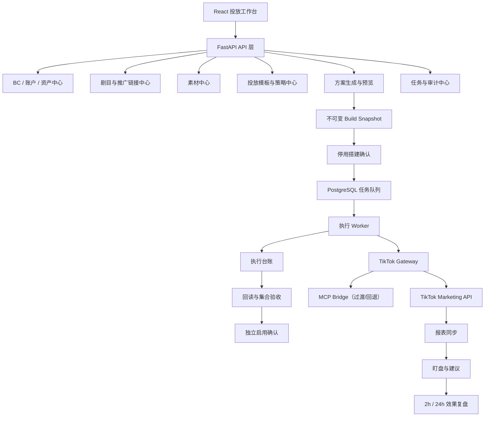

# TikTok 漫剧广告投放工具建设方案

> 文档状态：立项方案（待确认）
> 编制日期：2026-09-02
> 建议项目名：`tiktok_ad_automation`
> 建议项目位置：`/Users/yaotingfeng/Documents/ytf/ytf-ad-skill/tiktok_ad_automation`

## 一、结论

TikTok 漫剧广告投放工具应作为一个独立项目建设，不直接扩展现有巨量引擎项目 `ad_automation`，也不复制其完整代码。

建设原则是：

> 业务模型、数据库、接口适配器和执行流程全部按 TikTok 重新设计；参考并选择性复用原系统的架构模式、工程经验和少量通用基础设施。

最终形成两个边界清晰、可独立演进的系统：

```text
ytf-ad-skill/
├── ad_automation/              # 巨量引擎广告投放系统
└── tiktok_ad_automation/       # TikTok 漫剧广告投放系统

ytf-os-ad-skill/
├── TikTok AD/                  # TikTok SOP、接口实测、历史报告和取链工具
└── .codex/skills/
    └── tiktok-smart-plus-drama-ads/  # TikTok 批量搭建规则与安全工作流
```

两个系统暂不共享领域表、执行器和广告对象，只在未来确有稳定需求时，通过 API 或独立公共包共享登录、通知等横向能力。

## 二、项目背景

现有 `ad_automation` 已覆盖巨量引擎漫剧/短剧投放，具备剧目、素材、主体、CID、账户、商品库、广告搭建、任务队列、报表、盯盘和策略执行等能力。

TikTok 当前也已沉淀一批可运行的本地能力：

- 嘉书、网眼推广链接生成 CLI。
- 剧单解析、规范化和完整行序轮转。
- Smart+ Minis Campaign、Ad Group、Ad 参数样例。
- VID 接力上传和素材账户共享。
- source material 到 target video 的映射校验。
- 批次 runbook、断点 ledger 和三层状态验收。
- Xingyu、Junbo 两套独立 TikTok Ads MCP 连接。
- Junbo 半小时消耗和 D0 ROAS 监控。

但这些能力目前分散在 Markdown、Node.js CLI、JSON 台账和本地监控脚本中，还没有形成支持多人协作、权限控制、持续执行、断点恢复和统一审计的产品化系统。

## 三、为什么不直接改造 `ad_automation`

### 3.1 核心业务对象不同

| 领域 | 巨量系统 | TikTok 系统 |
|---|---|---|
| 组织与授权 | 组织、主体、CID、广告主、抖音号 | Business Center、Advertiser、Identity |
| 广告层级 | 项目、单元、素材 | Campaign、Ad Group、Ad、Creative |
| 剧目来源 | 自有目录、飞书、长读等 | 嘉书、网眼及后续海外分销渠道 |
| 推广链接 | IAA/IAP 链接、商品关联 | TT Minis Link、归因 Campaign 基础名称 |
| 素材归属 | EBP org 内复用 | 源广告账户素材、跨账户共享、目标账户 VID |
| 落地资产 | 商品库、商品、抖音号 | Minis、Identity、CTA portfolio |
| 策略参数 | IAA/IAP/CBO、主体/CID 系数 | Smart+、VBO、ROAS、地区、语言、归因窗口 |
| 报表指标 | 巨量项目/单元/素材指标 | Native Growth 收入、D0/D6/D13 ROAS、Creative Report |
| 状态操作 | 项目/单元启停 | Ad → Ad Group → Campaign 分层启用 |

TikTok 不是现有巨量执行网关的另一个 provider。若强行共用 `project_id`、`promotion_id`、`ExecutionService` 和现有策略模型，会持续产生平台判断、空字段、JSON 兜底和语义混用。

### 3.2 可复用代码比例有限

现有系统真正可以直接复用的代码很少，主要价值来自以下经验：

- 预览与执行参数必须通过不可变 snapshot 冻结。
- 一次业务提交拆成 submission、item、execution job。
- worker 使用数据库租约、幂等键、限流桶和延迟重试。
- 远端创建每成功一步立即保存 ID 和状态。
- 超时表示结果未知，必须先回读再决定是否重试。
- 报表事实与远端对象详情分开存储。
- 高风险动作需要审批、操作日志和效果复盘。

这些应当在新项目中用更轻量、符合 TikTok 语义的代码重新实现，不应为了复用而引入整个巨量领域。

### 3.3 继续扩展会增加现有系统负担

`ad_automation` 已是大型系统，并存在较多复杂服务和长流程。将 TikTok 继续放入同一套领域代码，会导致：

- 开发者必须同时理解两套平台的大量历史约束。
- 一个改动需要验证两套广告链路。
- 数据库表和接口命名越来越抽象，降低可读性。
- 平台级故障、限流和权限问题互相影响。
- 部署、回滚和策略发布不能独立进行。

因此，新建独立项目的长期成本低于在旧系统中继续扩展。

## 四、建设目标与范围

### 4.1 产品定位

系统不是单纯的“批量建广告页面”，而是一套 TikTok 漫剧投放作战台：

```text
剧目准备
→ 推广链接
→ 素材归组与共享
→ 账户分配
→ 搭建方案预览
→ 停用创建
→ 回读验收
→ 独立启用
→ 消耗与 ROAS 监控
→ 补建/控损建议
→ 操作效果复盘
```

### 4.2 MVP 范围

第一版必须支持：

1. Xingyu、Junbo BC 显式选择和严格隔离。
2. 广告账户、Minis、Identity 等资产发现和状态回读。
3. 嘉书、网眼剧目及推广链接同步/生成。
4. VID 模式和统一素材账户模式。
5. 素材归组、去重、共享、目标账户回查和封面处理。
6. 版本化投放模板和账户轮转策略。
7. Campaign、Ad Group、Ad 搭建方案预览。
8. 用户确认后创建全部 `DISABLE` 对象。
9. 断点续建、精确名称幂等检查和空结构清理。
10. 三层对象、状态及素材集合验收。
11. 独立启用确认，并按 Ad → Ad Group → Campaign 开启。
12. 账户、剧目、Campaign、Ad、素材维度的消耗和 Native Growth ROAS 报表。
13. 任务中心、失败明细、API 调用日志和操作审计。

### 4.3 MVP 暂不包含

- 自动提高预算或 ROAS 目标。
- 自动批量关停正在跑量的核心广告。
- 自动扩大到新的 BC 或账户池。
- 自动使用 Smart Fix 改变素材字节。
- 自动使用跨剧历史素材补量。
- 无人工确认的全自动放量或控损。
- 将巨量和 TikTok 广告统一成一套跨平台领域模型。

上述能力在积累足够的 2 小时、24 小时效果数据和人工采纳记录后再分阶段开放。

## 五、总体架构



### 5.1 技术栈

建议延续团队已熟悉的技术栈，但建立全新的轻量实现：

| 层级 | 建议技术 |
|---|---|
| 后端 | Python 3.11+、FastAPI、Pydantic |
| 数据库 | PostgreSQL 16 |
| 数据访问 | psycopg 3；保持显式 Repository，不引入重 ORM |
| 前端 | React、TypeScript、Vite、TanStack Query/Table |
| 后台任务 | PostgreSQL 租约队列，不强制引入 Redis |
| API 适配 | 独立 TikTok Gateway；官方 API 为主，MCP 为过渡 |
| 测试 | pytest、Vitest、Node deterministic fixtures |
| 部署 | 前端、API、Worker 分进程部署；测试与生产环境隔离 |

## 六、代码结构

```text
tiktok_ad_automation/
├── backend/
│   ├── app/
│   │   ├── api/
│   │   ├── auth/
│   │   ├── common/
│   │   │   ├── database/
│   │   │   ├── jobs/
│   │   │   ├── rate_limit/
│   │   │   ├── credentials/
│   │   │   ├── notifications/
│   │   │   └── audit/
│   │   └── tiktok/
│   │       ├── business_centers/
│   │       ├── advertisers/
│   │       ├── assets/
│   │       ├── dramas/
│   │       ├── links/
│   │       ├── materials/
│   │       ├── creatives/
│   │       ├── strategies/
│   │       ├── planning/
│   │       ├── execution/
│   │       ├── verification/
│   │       ├── activation/
│   │       ├── reporting/
│   │       └── monitoring/
│   ├── migrations/
│   └── tests/
├── frontend/
│   └── src/features/tiktok/
├── scripts/
├── docs/
└── .github/workflows/
```

模块之间只通过明确的应用服务和数据契约调用，禁止从报表模块直接调用写接口，也禁止 Planner 直接操作 TikTok。

## 七、核心领域模型

### 7.1 Business Center 与账户

#### `TikTokBusinessCenter`

- `bc_id`
- `name`
- `connection_key`
- `status`
- `credential_ref`
- `environment`

`connection_key` 必须显式区分：

- `tiktok-ads-xingyu`
- `tiktok-ads-junbo`

没有明确 BC 时，不允许调用任何 TikTok 接口，包括只读接口。

#### `TikTokAdvertiser`

- `advertiser_id`
- `bc_id`
- `name`
- `status`
- `currency`
- `timezone`
- `balance`
- `owner_bc_id`
- `last_synced_at`

所有账户池必须属于单一 BC。跨 BC 账户不能进入同一个搭建提交。

### 7.2 剧目与推广链接

#### `TikTokDrama`

- 内部剧目 ID
- 渠道：嘉书、网眼或未来渠道
- 渠道剧目 ID
- 中英文剧名
- 语种
- 集数
- 状态
- 上线时间
- 原始来源与原始数据

#### `TikTokPromotionLink`

- 剧目 ID
- 渠道
- 渠道项目/应用
- TT Minis Link
- Campaign 完整基础名称
- Minis ID
- 跳转集数
- 归因参数
- 创建/回查状态

网眼 `{b…/s…/c…}` 段和嘉书渠道参数必须保存为不可修改的来源事实，不能在广告创建时临时推导。

### 7.3 素材

#### `TikTokMaterial`

- 内部素材 ID
- 剧目 ID
- 文件名
- 来源渠道与批次日期
- 文件签名/MD5
- 宽高、时长、码率、大小
- 原始 VID
- 内容标签、语言、风险状态

#### `TikTokMaterialAsset`

表示素材在某个广告账户中的实际远端资产：

- `material_id`
- `video_id`
- `image_id`
- `advertiser_id`
- `displayable`
- `placements`
- `video_cover_url`
- `remote_status`
- `remote_raw_json`

#### `TikTokMaterialMapping`

记录跨账户素材映射：

```text
源账户 + 源 material/video
→ 目标账户 + 目标 material/video/image
```

不能假设共享后目标 VID 与源 VID 一致。

### 7.4 广告对象

分别保存：

- `TikTokCampaign`
- `TikTokAdGroup`
- `TikTokAd`
- `TikTokAdCreative`

各表均需保存：

- 远端 ID。
- 精确名称。
- 父级 ID。
- 所属 BC 和 Advertiser。
- 初始操作意图。
- 实际 `operation_status`。
- 审核/业务状态。
- 远端创建和修改时间。
- 最后回读时间。
- 原始响应。

不得把 Ad Group 和 Ad 压缩为一张“广告明细表”。

## 八、投放模板与策略版本

现有文档中至少存在以下不同投法：

- 每剧 10 户、每户 2 条普通 Ad、前两户加 Test Ad。
- 每剧 2 户、每户 1 条 Ad、ROAS 1.07。
- 一个 Campaign 下 2～3 个 Ad Group 的历史样例。
- 使用历史高消耗素材的应急补量方案。
- Xingyu 与 Junbo 各自独立的账户和资产配置。

这些必须保存为不同策略版本，不能互相覆盖：

| 示例版本 | 用途 |
|---|---|
| `xingyu_smartplus_10x2_sp_ab_v1` | Xingyu 常规 Smart+ Minis 搭建 |
| `qsh_two_account_107_v1` | 历史 qsh 双账户批次复现 |
| `emergency_top_material_test_v1` | 历史起量素材应急补量 |
| `junbo_smartplus_default_v1` | Junbo 独立账户资产下的模板 |

每个模板至少包括：

- 适用 BC、渠道和 Minis。
- 账户池筛选及排序。
- 每剧账户数和轮转算法。
- Campaign、Ad Group、Ad 数量结构。
- 普通/Test 广告规则。
- 命名模板。
- 预算、ROAS、地区、语言、年龄、版位和归因窗口。
- Identity、CTA 和文案策略。
- 素材来源及异常处理。
- 初始状态。
- 策略版本和生效时间。

账户 ID、Identity ID、BC ID、Minis ID 等资产事实不能直接硬编码在程序默认值中。模板只能引用经过当前 BC 回读验证的资产记录。

## 九、核心执行流程

### 9.1 数据准备

```text
选择 BC
→ 同步授权 Advertiser
→ 同步 Minis / Identity
→ 导入或同步剧目
→ 生成/回查推广链接
→ 发现素材
→ 生成可搭建状态
```

### 9.2 素材处理

支持两个互斥入口：

1. 剧单直接提供 VID。
2. 从统一素材账户按渠道、素材批次日期和规范化剧名检索。

统一流程：

```text
来源素材归组
→ 剧内/全局去重
→ 源账户 info 回查
→ 按平台上限拆分共享批次
→ 共享到目标账户
→ 目标账户 search + info 回查
→ 上传/确认封面
→ 保存 source-to-target 映射
```

只有目标账户可回查、可展示、支持 TikTok 版位且封面完整的素材才能进入广告快照。

### 9.3 方案预览

Planner 只生成方案，不调用写接口。预览必须展示：

- BC 和实际连接名。
- 剧目总数、可搭建数和排除原因。
- 账户池及每剧账户窗口。
- 每账户 Campaign、Ad Group、普通 Ad、Test Ad 数量。
- 每剧素材数和全局唯一素材数。
- 渠道、Minis、Identity 和地区映射。
- 完整三级命名。
- 预算、ROAS、定向、文案和 CTA。
- 素材共享与验证任务量。
- 所有 blocker 和 warning。

预览保存为不可变 snapshot。提交创建时只能消费已确认的 snapshot，不允许重新读取默认值后静默改变方案。

### 9.4 停用创建

用户确认方案只授权创建 `DISABLE` 对象：

```text
CTA portfolio
→ Campaign(DISABLE)
→ Ad Group(DISABLE)
→ Ads(DISABLE)
→ 三层回读
→ 素材集合回读
→ 停用态审计
```

每成功一步立即写入 ledger。部分失败时从缺失阶段续建，不重建已存在对象。

遇到 RPC/Internal timeout 时：

1. 标记为结果未知。
2. 按精确名称或已知 ID 回读。
3. 已存在则补写 ID 并继续。
4. 确认不存在才重试 create。

### 9.5 启用

只有停用态审计通过并获得第二次明确授权后，才生成 activation plan：

```text
启用 Ads 并回读
→ 启用 Ad Groups 并回读
→ 启用 Campaigns 并回读
→ 全量 ENABLE 审计
```

任一子层失败时，不启用对应父层。`code=0`、提交成功或 `PROCESSING` 都不能当作最终完成。

## 十、任务与状态机

### 10.1 Build Submission

一次用户确认对应一个 `tiktok_build_submission`，其下拆成多个按“Advertiser × 剧目”执行的 item。

### 10.2 Build Item 状态

```text
draft
→ previewed
→ build_confirmed
→ sharing_materials
→ verifying_materials
→ creating_cta
→ creating_campaign
→ creating_adgroup
→ creating_ads
→ verifying_disabled
→ verified_disabled
→ activation_pending
→ enabling_ads
→ enabling_adgroups
→ enabling_campaign
→ verified_enabled
```

异常终态：

- `blocked`
- `partial_failed`
- `failed`
- `cancelled`
- `cleaned`

状态迁移必须通过服务方法完成，禁止页面直接更新数据库状态。

### 10.3 Execution Job

`execution_jobs` 只负责技术调度：

- `job_type`
- `queue_key`
- `bc_id`
- `advertiser_id`
- `rate_limit_group`
- `payload_snapshot`
- `priority`
- `status`
- `attempt_count`
- `next_run_at`
- `lease_owner/token/expires_at`
- `last_error`

限流 key 至少包含：

```text
platform + BC + advertiser + endpoint_group
```

例如：

```text
tiktok:xingyu:7675...:smart_plus_write
tiktok:junbo:7678...:report_read
```

## 十一、TikTok Gateway 设计

上层业务不能直接依赖 MCP 工具名或 HTTP 细节，应定义 TikTok 语义的 Gateway：

### 11.1 授权与账户

- 获取授权广告账户。
- 读取广告账户详情。
- 校验账户级读取/写入权限。

### 11.2 资产

- 获取 Minis。
- 获取 Identity。
- 创建/读取 CTA portfolio。

### 11.3 素材

- 搜索视频。
- 获取视频详情。
- VID/URL 上传。
- 封面查询和图片上传。
- 跨账户资产共享。
- Smart Fix 查询和执行（默认关闭）。

### 11.4 广告对象

- Campaign create/get/status update。
- Ad Group create/get/status update。
- Ad create/get/status update。
- 审核状态和拒绝原因读取。

### 11.5 报表

- 同步 integrated report。
- 异步 report task。
- Smart+ creative report。
- Video Insight report。

Gateway 建议提供两种实现：

| 实现 | 定位 |
|---|---|
| `TikTokMarketingApiGateway` | 正式生产主实现，直接接官方 Marketing API |
| `TikTokMcpGateway` | 早期联调、过渡和紧急回退 |

现有 Junbo 监控已经证明可以通过本机 app-server 直接调用 MCP、不经过模型。该方式适合快速启动，但正式服务仍应优先使用独立 OAuth 和官方 API，以便管理权限、token 生命周期、部署和调用审计。

## 十二、报表与监控

### 12.1 数据口径

至少保存：

- spend、impressions、clicks、CTR、CPC、CPM。
- Native Growth D0 广告收入和 D0 ROAS。
- 可获得的 D1/D6/D13 收入与 ROAS。
- Campaign、Ad Group、Ad 层级状态。
- 素材消耗、收入、ROAS 和素材集中度。
- 审核状态、拒绝原因和回传异常。

汇总 ROAS 必须按“收入合计 ÷ 消耗合计”计算，不能简单平均各行 ROAS。

报表时间按 Advertiser 时区归属；页面同时显示账户统计日和北京时间观测时间。TikTok 省略零数据行时，系统需以已同步的对象全集补零，不能把缺行解释为对象不存在。

### 12.2 监控阶段

第一阶段只提供事实和建议：

- 账户接量情况。
- 剧目消耗与 D0 ROAS。
- Campaign/Ad/素材消耗集中度。
- 审核和状态异常。
- 无消耗、低 ROAS、快速超量候选。
- 正常素材与 Test 素材对照。

第二阶段才引入动作建议：

- 继续观察。
- 补账户/补广告。
- 补本剧素材。
- 停止扩量。
- 限预算或暂停候选。

所有阈值必须版本化、可配置，并记录系统建议、人工最终动作、2 小时结果和 24 小时结果。

## 十三、权限与安全

### 13.1 操作分级

| 操作 | 默认权限 |
|---|---|
| 查看账户、资产、素材、广告和报表 | 有对应 BC 查看权限即可 |
| 生成搭建预览 | Operator |
| 创建停用广告 | Manager 明确确认 |
| 启用广告 | Manager 第二次明确确认 |
| Smart Fix | 单独授权 |
| 批量暂停、改预算、改 ROAS | 高风险审批 |
| 删除广告结构 | 高风险审批并保留审计 |

### 13.2 强制安全规则

- 调用任何 TikTok 接口前必须明确选择 Xingyu 或 Junbo。
- 两个 BC 使用独立凭证、账户、素材、Identity、Minis 和配置。
- 不允许从当前仓库中的 Xingyu 默认值推断 Junbo 资产。
- 所有新建对象初始为 `DISABLE`。
- 搭建确认不等于启用确认。
- 未通过素材和三层状态审计不得启用。
- 不保存明文 token、cookie 或 session。
- 日志中的请求和响应必须脱敏并限制长度。
- 测试环境默认禁止真实写操作。

## 十四、页面规划

| 页面 | 主要能力 |
|---|---|
| 首页 | BC 总览、账户数量、当日消耗、D0 ROAS、异常任务 |
| BC 与授权 | OAuth、连接状态、账户发现、权限检查 |
| 剧目中心 | 嘉书/网眼剧目、语言、上线状态、推广链接 |
| 素材中心 | 素材归组、源/目标映射、可投状态、审核异常 |
| 投放模板 | 账户轮转、命名、预算、ROAS、定向、广告结构 |
| 搭建工作台 | 选 BC、选剧、选模板、生成预览、确认停用搭建 |
| 任务中心 | Submission、Item、执行阶段、错误和续建 |
| 停用验收 | 三层对象、素材集合和状态审计 |
| 启用中心 | 待启用清单、二次确认、分层启用结果 |
| 广告管理 | Campaign/Ad Group/Ad 查询与状态操作 |
| 盯盘 | 账户、剧目、广告、素材消耗和 ROAS |
| 操作复盘 | 系统建议、人工动作、2h/24h 效果 |

MVP 首先实现 BC/资产、剧目链接、素材、搭建、任务、验收和基础盯盘页面；策略自动化页面后置。

## 十五、现有资产迁移计划

### 15.1 第一批迁移

从当前项目迁入并补充单元测试：

- `parse-drama-sheet.mjs`
- `build-manifest.mjs`
- `build-batch-runbook.mjs`
- `audit-batch-ledger.mjs`
- VID relay 相关库与测试
- 嘉书推广链接 CLI 的接口知识
- 网眼推广链接 CLI 的接口知识
- Junbo 监控中的报表口径和补零逻辑

迁移方式不是简单复制 CLI，而是：

1. 提取纯函数和 schema。
2. 固化输入输出契约。
3. 为历史样例建立 fixture。
4. 由应用服务调用。
5. CLI 保留为运维和离线排障入口。

### 15.2 不迁移内容

- 历史输出目录和账户级报告。
- 本地 session、cookie、token 和登录截图。
- 巨量 `ExecutionService`、Planner 和广告表。
- 历史文档里的直接 `ENABLE` 默认。
- 未标明 BC 归属的硬编码账户及身份资产。

## 十六、实施阶段

### P0：项目骨架和领域契约（3～5 个工作日）

- 新建独立仓库、CI、后端和前端骨架。
- 建立本地/测试/生产环境配置。
- 完成 BC、Advertiser、凭证和权限模型。
- 定义 Gateway、Build Snapshot 和状态机。
- 确认第一版数据库设计。

交付：可启动的空系统、数据库迁移、基础登录和自动测试。

### P1：资源准备与方案预览（1～2 周）

- 接入账户、Minis、Identity 读取。
- 接入嘉书、网眼剧目与推广链接。
- 接入两种素材来源和素材归组。
- 迁入 manifest、轮转和命名规则。
- 完成搭建方案预览和 blocker 展示。

交付：选择 BC 和剧目后能生成完整、可复现的搭建方案，但不能写广告。

### P2：停用搭建与启用验收（1～2 周）

- 素材共享和目标账户回查。
- CTA、Campaign、Ad Group、Ad 创建。
- PostgreSQL 任务队列和断点续建。
- 精确名称幂等和超时回读。
- 停用态审计和 activation plan。
- 独立启用确认及三层回读。

交付：小批量真实账户能够安全完成“停用搭建 → 验收 → 独立启用”。

### P3：报表与基础盯盘（1～2 周）

- 账户、Campaign、Ad、素材报表同步。
- D0/D6/D13 Native Growth 指标。
- 时区处理、零数据补齐和加权 ROAS。
- 飞书告警和页面盯盘。

交付：能够判断广告是否启用、是否通过审核、是否开始消耗以及当前回收表现。

### P4：策略建议和受控自动化（持续迭代）

- 剧目、账户、广告和素材生命周期。
- 补建、控损和放量候选。
- 策略版本、影子模式和历史回放。
- 人工采纳、2h/24h 效果评估。
- 低风险动作受控自动化。

预算修改、核心广告关停和大范围放量在积累足够证据前继续保持人工确认。

## 十七、测试与验收

### 17.1 自动测试

- 剧单字段解析成功和失败路径。
- 完整行序轮转，阻断剧仍占用轮转位置。
- Xingyu/Junbo 资产绝不混用。
- 渠道与 Minis 强绑定。
- 嘉书和网眼命名规则。
- 素材去重和长文件名唯一前缀匹配。
- material/share 批次上限。
- source-to-target 素材集合校验。
- 部分失败续建和超时回读。
- 停用态验收失败时不生成启用计划。
- Ads 未全部启用时不启用父级。
- 报表零行补齐和加权 ROAS。
- 时区跨日处理。

测试使用临时 fixture，不调用真实 TikTok 写接口。

### 17.2 MVP 验收标准

1. 未选择 BC 时所有 TikTok 请求均被阻断。
2. 一个 submission 内不存在跨 BC 账户或资产。
3. 预览数量、命名、账户窗口和最终创建结果可逐项对齐。
4. 所有创建对象初始状态为 `DISABLE`。
5. 任意阶段失败后可以从缺失阶段继续，不产生重复 Campaign。
6. 源素材、目标素材、广告 Creative 三段集合完全一致。
7. 停用审计未通过时无法启用。
8. 启用严格按 Ad → Ad Group → Campaign 顺序。
9. 最终回读能区分已启用、审核中、拒绝和已开始消耗。
10. 操作者、确认时间、参数快照、远端 ID、错误及重试过程全部可追溯。

## 十八、主要风险与应对

| 风险 | 应对 |
|---|---|
| 官方 API 权限不完整 | Gateway 双实现；先用 MCP 联调，同时推进官方权限 |
| Xingyu/Junbo 数据混用 | BC 作为所有表和任务的强制维度；连接名白名单 |
| 历史投法互相冲突 | 策略模板版本化，不设模糊全局默认 |
| 素材共享成功但目标不可用 | 每个目标账户执行 search + info 回查和集合验收 |
| 创建超时导致重复对象 | 精确名称、request ID、未知结果回读和阶段 ledger |
| 报表时区/延迟导致误判 | 保存账户时区、观测时点和成熟窗口；盘中 D0 明确标注 |
| Test 素材拿量但低回收 | 独立标记、预算上限、人工启用、单独统计和快速关闭 |
| 新系统复制旧系统复杂度 | 只迁纯逻辑和测试；禁止复制巨型服务和仓储 |

## 十九、立项前待确认事项

以下事项会影响第一版范围，需要在 P0 结束前确认：

1. 第一阶段先服务 Xingyu、Junbo，还是两者同时上线。
2. 正式生产是直接接 TikTok Marketing API，还是先以 MCP bridge 过渡。
3. 第一版使用哪一个投放模板作为主流程。
4. 嘉书和网眼是否都纳入 MVP。
5. 素材首期以统一素材账户为主，还是 VID 模式也必须同时上线。
6. 是否需要在 MVP 内集成推广链接“创建”，或先只支持导入和回查。
7. 报表首期观察 D0，还是同时落 D6/D13 成熟回收。
8. 使用独立登录，还是未来与 `ad_automation` 做统一登录跳转。
9. 测试与生产的服务器、域名和 PostgreSQL 资源。
10. 哪些角色可以确认停用创建，哪些角色可以确认启用。

## 二十、最终建议

项目应按以下口径启动：

> 新建独立的 `tiktok_ad_automation` 项目；业务和数据模型完全按 TikTok 设计；原巨量系统只作为架构、队列、安全和工程实现的参考；当前 TikTok 脚本作为领域规则和回归测试来源逐步产品化。

第一阶段先解决“数据正确、方案可审阅、停用搭建可续建、启用有审计”，再建设盯盘和策略自动化。不要为了追求跨平台统一而牺牲 TikTok 领域的清晰度，也不要在没有效果复盘数据时直接开放高风险自动动作。

## 附录：主要参考资料

- `../.codex/skills/tiktok-smart-plus-drama-ads/SKILL.md`
- `../.codex/skills/tiktok-smart-plus-drama-ads/references/TikTok Ads MCP 执行工作流.md`
- `../.codex/skills/tiktok-smart-plus-drama-ads/references/批量执行经验与故障恢复.md`
- `TikTok Smart+ 端原生短剧广告搭建参考（实投参数与完整 JSON）.md`
- `TikTok Smart+ 短剧广告创建参考（逆向自线上在投广告）.md`
- `TikTok Smart+ 短剧广告创建样例（完整 JSON 参数）.md`
- `TikTok 跨账户素材复用：VID 直传 vs URL 接力（实测报告）.md`
- `TikTok 短剧历史起量素材应急补量 SOP.md`
- `海外分销小程序获取推广链接步骤.md`
- `../TikTok-10账户会话交接.md`
- `junbo-ads-monitor/README.md`
- `/Users/yaotingfeng/Documents/ytf/ytf-ad-skill/ad_automation/AGENTS.md`
- `/Users/yaotingfeng/Documents/ytf/ytf-ad-skill/ad_automation/docs/architecture/ad-strategy-automation-system-plan.md`
