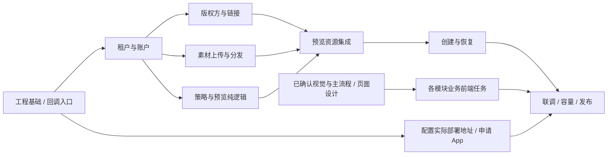

# TikTok 自动投放工具交付总计划 Implementation Plan

> **For agentic workers:** REQUIRED SUB-SKILL: Use superpowers:subagent-driven-development (recommended) or superpowers:executing-plans to implement this plan task-by-task. Steps use checkbox (`- [ ]`) syntax for tracking. 按用户偏好按需使用相关技能，不自动扩大为整套流程。

**Goal:** 用七份可独立验收的阶段计划实现用户已确认的多租户 TikTok 短剧自动投放工具。

**Architecture:** 独立 FastAPI 全栈应用，模块化业务后端，Celery/Redis 后台任务，PostgreSQL 状态与对象存储。平台管理员切换租户使用同一工作台；所有外部资源调用保持租户与 BC 范围。

**Tech Stack:** FastAPI 官方全栈模板、Python/SQLModel、PostgreSQL、Celery/Redis、React/TypeScript、shadcn/ui、官方 TikTok Python SDK。

**Spec:** [整体设计](../specs/2026-09-08-tiktok-00-overall-design.md)，其中链接五份功能设计；本组设计已获用户确认。

## Global Constraints

- 接入 BC 下全部有权限接入的账户，按大量账户设计。
- 剧目和账户使用批量粘贴；账户支持 ID 或完整名称。
- 广告搭建时，根据剧名在文件名中进行包含匹配。
- 所有输入剧目铺到同一批输入账户；不采用滑动轮转或账户窗口。
- 每个“剧目 × 账户”创建一个 Campaign；每个素材组对应一个 Ad Group。
- 每个 Ad Group 创建 N 条普通 Smart+ Ad，命名为 SP1～SPN；相同素材、不同文案。
- Campaign 日预算，组内多个 Ad Group 共享，不随素材组数或 SP 数自动倍增。
- 目标 ROAS，具体数值在策略模板中填写。
- Campaign、Ad Group、Ad 创建时直接使用 ENABLE。
- 保留成功对象，只补缺失步骤；创建结果未知时先回读核实。
- 数据同步、分析报表、财务核算、自动调价不纳入本轮实现。

---

## 文档状态与执行边界

设计确认日期：2026-09-08。2026-09-09 已在用户指定 Git 仓库实施 P01～P06，并完成两版权方离线主链与页面验收；P07 的最新状态、精确提交和外部验收条件分别见[实施进度](../../implementation-progress.md)、[离线验收](../../acceptance/offline.md)与[真实联调](../../acceptance/live-sdk.md)。阶段计划中的原始步骤保留作设计依据，执行证据以这些记录为准。

前端覆盖更正：已确认的是业务规则、功能边界与技术路线。本轮补齐了[12页整体交互设计](../specs/2026-09-08-tiktok-06-frontend-experience-design.md)、功能页面布局与状态，以及[核心流程原型](../prototypes/2026-09-08-tiktok-workbench.html)。2026-09-09用户确认原型视觉与三步搭建主流程；原计划的前端任务已按页面 ID 和验收场景细化，作为本轮实施依据。

应用根目录采用 `/Users/yaotingfeng/Documents/ytf/ytf-os-ad-skill/projects/tiktok-ad-automation`，与现有投放资料和脚本独立。各计划代码路径均相对这个目录；执行时若已有工程先核对并复用，不覆盖现有文件。当前资料目录不初始化 Git。

具体域名、部署机器、TikTok App 凭据尚未提供，计划将它们列为执行阶段的配置输入。工程环境、认证接口、租户隔离、回调路由、确定性预览算法及模拟外部调用可以先行；业务页面的布局与交互实现采用已确认视觉与主流程，以及本轮补充设计，详细页面通过阶段演示核对。真实资产发现与试投须单列实际完成证据。

## 前端设计补齐产物与计划对应

原计划从业务规则拆到模型、接口与任务，再为各模块增加前端实现和行为测试。这里缺少从用户操作到完整页面的独立设计环节；指定 shadcn 和列出组件不能替代该环节。

| 工作 | 具体产物 | 完成判断 |
| --- | --- | --- |
| 全局工作台 | 一份前端整体与交互设计：平台/租户入口、菜单、租户和 BC 上下文、内容区域、页面间跳转、桌面布局与可用宽度 | 每个入口有目标页面，平台与租户操作范围能从页面识别 |
| 功能页面 | 在现有五份功能设计中补页面清单、区块布局、字段/表格列、主要操作、批量操作及状态矩阵 | 正常、空数据、加载、异常、权限不足、部分成功均有可执行交互 |
| 核心原型 | 广告搭建“批量输入→准备结果→素材调整→搭建预览→提交进度”的可审阅原型，再覆盖素材与策略高频页面 | 能走完成功和部分异常场景，验证操作效率及信息层级 |
| 视觉规则 | 基于 shadcn 统一字体层级、间距、表格密度、状态色、表单反馈、弹窗与抽屉规则 | 同类操作和状态在不同页面保持一致 |
| 计划回写 | 把页面设计映射到 P01～P06 的具体前端任务，P07 补页面状态与原型对应的验收 | 每个前端任务可指向明确页面设计和验收场景 |

上述产物已形成实施依据：UI-01～UI-12 页面清单、S01～S08 统一状态、五份功能文档的详细布局、批量搭建/素材/策略/任务交互原型。原型使用示例数据，管理页以布局演示为主；不代表实际授权、上传或广告执行已经实现。

受影响的任务：P01 Task 5 的工作台布局、P02 Task 7、P03 Task 5、P04 Task 5、P05 Task 6、P06 Task 6 的界面部分，以及 P07 Task 1 的页面验收。P01 的接口、任务基础和回调能力可以独立推进；前端补齐工作本身不产生广告写入。

## 七阶段索引

| 阶段 | 计划 | 交付与验收结果 | 前置 |
| --- | --- | --- | --- |
| P01 | [工程基础与回调入口](2026-09-08-tiktok-01-foundation-plan.md) | 固定官方工程基线、登录入口、公共契约、后台进程、共享调用额度及回调路由 | 无 |
| P02 | [租户与账户](2026-09-08-tiktok-02-tenants-accounts-plan.md) | 平台切换租户、固定角色、独立授权、全部账户分页目录、批量解析 | P01 |
| P03 | [版权方与推广链接](2026-09-08-tiktok-03-provider-links-plan.md) | 网眼/嘉书独立连接、剧目解析、推广配置冲突检测、链接复用 | P02 |
| P04 | [素材上传与分发](2026-09-08-tiktok-04-materials-plan.md) | 批量上传、系统选源账户、按文件名检索、目标账户资产复用和分发恢复 | P02 |
| P05 | [策略与搭建预览](2026-09-08-tiktok-05-strategies-preview-plan.md) | 100 条文案、策略版本、全组合展开、可调整且可冻结的预览 | P02；资源集成依赖 P03/P04 |
| P06 | [广告执行与恢复](2026-09-08-tiktok-06-build-execution-plan.md) | 创建即启用、逐步落库、提交幂等、未知结果核查、部分失败续建和公平调度 | P03/P04/P05 |
| P07 | [联调、容量与发布验收](2026-09-08-tiktok-07-validation-release-plan.md) | 跨模块流程、隔离与故障演练、大量账户验证、实际 SDK 联调证据与运行手册 | P01～P06；真实联调需 App/权限 |

并行范围为版权方与素材模块，以及不调用外部服务的策略逻辑。共享数据库迁移、公共契约和路由总表由集成者合并；不让多个执行者同时修改同一个公共文件。

具体执行时，先完成 P05 Tasks 1～4 的策略与草稿，再先行完成 P06 Task 2 的只读场景能力契约，接着完成 P05 Tasks 5～6 的预览与界面，最后推进 P06 其余任务。P06 Task 2 只消费已定义的场景/草稿类型，不依赖提交或广告执行。所有模块从 P01 Task 7 消费共享调用准入，素材模块不反向依赖广告执行模块。

## 2026-09-09 实施推进方式

沿用七份阶段计划，不增加重复的功能开发计划。执行任务仍以各计划的 Task 为准；以下五批是面向演示和验收的交付节奏。每批都包含前端、接口、业务行为与相应检查，已确认的原型作为视觉对照。该安排已用于本轮实施；实际页面与结果见[功能交付对照](../../acceptance/functional-delivery.md)。

| 交付批次 | 计划范围 | 可演示、可验收的结果 |
| --- | --- | --- |
| 1. 正式工作台与租户基础 | P01 → P02 | 独立工程可启动；真实登录、平台创建租户、成员角色与租户切换；shadcn工作台还原已确认视觉；账户与授权入口、隔离测试、后台任务基础、回调路由与可部署包 |
| 2. 投放资源与策略 | P03/P04并行，P05 Tasks1～4中的策略与草稿逻辑并行 | 租户独立版权方连接和取链、原文件批量接收与上传队列、策略版本及结构示例；每个模块页面连接本地真实API和持久化，外部调用使用显式测试替身直到具备真实凭据 |
| 3. 完整搭建预览 | P05 Tasks5～6；先完成P06 Task2场景能力契约 | 批量粘贴→解析准备→素材调整→全部剧目×账户→预览冻结；正确显示实际数量、预算、排除项与SP文案，刷新可恢复草稿 |
| 4. 执行与恢复 | P06其余任务 | 创建即启用、任务详情、逐步保存远端结果、失败续建、未知先核查、提交幂等；测试环境跑通完整业务链路 |
| 5. 联调与上线验收 | P07 | 跨租户与故障验收、大量账户/组合容量测试、真实授权与官方SDK联调、所选部署环境验证和具体小批量试投证据 |

第一批完成标准：本地可启动并登录；平台可创建租户和成员、进入其工作台；数据库重启后数据仍在；不同租户访问隔离有效；后台任务可执行并保存状态；前端符合当前原型的布局、表单和反馈；交付登录/回调路由的部署配置与验证方法。租户创建不依赖TikTok App；真实BC账户发现和完整OAuth成功状态依赖App凭据及授权，不使用演示账户冒充实际已接入账户。

部署资源具备时，第一批即可部署入口，验证真实HTTPS回调地址，再用于TikTok开发者应用申请；没有实际域名/运行环境时只交付可部署包，不声称公网回调地址已可用。App申请与第2～4批开发并行；版权方的真实验证也独立记录各租户连接凭据与接口结果。

并行按模块文件边界拆分。公共契约、共享前端组件、数据库迁移和集成由主线程统一；每个任务完成后做代码审查、针对性测试和提交，再接入主分支。只有通过真实模块接口和数据库的页面才计为业务页面交付；Mock外部调用通过与真实SDK联调通过分开标记。

阶段汇报记录：已经可操作的页面、完成的业务行为、验证结果、仍待外部条件的项目和下一批范围。常规实现选择按已确认设计自主推进；涉及需求变化或具体外部资源不足时再集中讨论。

## 公共文件与模块所有权

| 责任方 | 创建或维护的范围 |
| --- | --- |
| P01 | `backend/app/core/{context,errors,pagination,logging}.py`、`backend/app/jobs/{models,outbox,celery_app,tasks}.py`、工程配置和工作台骨架 |
| P02 | `backend/app/modules/tenants/`、`backend/app/modules/accounts/`、`backend/app/core/credentials.py`、`backend/app/integrations/tiktok/{sdk,auth,accounts}.py` |
| P03 | `backend/app/modules/providers/` 及版权方协议接入，不修改全局 CLI 会话 |
| P04 | `backend/app/modules/materials/`、对象存储与视频传输，不管理剧目关系或广告创建 |
| P05 | `backend/app/modules/strategies/`、`backend/app/modules/builds/` 内草稿/预览/纯计划生成部分 |
| P06 | `backend/app/modules/builds/` 内提交/执行/核查部分、调用限流和业务调度 |
| P07 | 跨模块 fixtures、场景验收、容量脚本、部署和故障恢复文档 |

前端按 `frontend/src/features/<module>/` 组织业务组件，页面入口使用模板 TanStack Router 的 `frontend/src/routes/`。复用现有 shadcn 组件，不复制一套新的 UI 基础设施。数据库迁移位于模板现有 `backend/app/alembic/versions/`。

## 跨计划接口约定

下表是依赖索引；完整类型定义与测试代码由标注的计划拥有。引用其他计划的执行者应读取接口所在任务，不重新发明字段别名。

| 提供方 | 公共接口 | 使用约束 |
| --- | --- | --- |
| P01 | `TenantContext(tenant_id: UUID, actor_id: UUID, role: str)` | 不可变；仅携带上下文，本身不授予权限 |
| P01 | `DomainError(code: str, message: str, retryable: bool=False)`；`Page[T](items, next_cursor)` | API 和 Worker 共用错误码；列表服务端分页 |
| P01 | `enqueue_after_commit(session, *, context, task_name, task_key, payload) -> UUID` | 与业务变更同事务写待投递记录；不在提交前发消息 |
| P01 | `admit_call(redis_client, *, app_scope, endpoint, tenant_id, advertiser_id, lease_id, policy) -> Admission`；`release_call` | 多 Worker 共用应用与端点额度；Admission 字段为 granted/retry_after_ms |
| P02 | `require_tenant(session, *, actor_id, tenant_id, action) -> TenantContext` | 后台每个外部写步骤重新校验；排队时旧 role 不可信 |
| P02 | `resolve_account_access(session, *, context, bc_id, advertiser_id, action) -> AccountAccess` | BC 资产与连接授权的交集 |
| P02 | `assign_upload_account(session, *, context, bc_id) -> AccountAccess` | 系统分配并由素材模块保存本次选择 |
| P02 | `sdk_client(session, *, context, connection_id)` | 独立官方 ApiClient；显式令牌取自实例 header，不修改全局 token |
| P02 | `encrypt_credentials(*, tenant_id, value)` / `decrypt_credentials(*, tenant_id, ciphertext)` | 加密内容绑定租户，日志及浏览器不读取凭据明文 |
| P03 | `prepare_links(session, *, context, connection_id, application_id, lines, config, request_id) -> UUID` | 返回任务 ID；取链可有版权方写入，不能当作只读权限 |
| P03 | `get_link_results(session, *, context, task_id, cursor=None) -> Page[ResolvedLink]` | 带原始输入行与逐剧状态；真实剧目 ID、URL 和归因名明确 |
| P04 | `match_materials(session, *, context, bc_id, title, cursor=None) -> Page[MaterialCandidate]` | 仅文件名包含完整剧名；上传时不归剧 |
| P04 | `get_material_readiness(session, *, context, bc_id, material_id, advertiser_id) -> MaterialReadiness` | 预览只检查合法分发路径，不提前分发 |
| P04 | `ensure_target_asset(session, *, context, bc_id, material_id, advertiser_id, task_key) -> AssetPreparation` | 提交后执行；已有目标资产、分享源或原文件上传均可成为合法路径 |
| P05/P06 | 草稿、预览、提交和核查契约 | 详见两份计划的 Interfaces；远端素材映射与冻结创意内容分开保存 |

权限动作统一为 `read/manage/build/upload/strategy_write/provider_write`；角色统一为 `platform_admin/tenant_admin/operator/viewer`。外部 TikTok ID 使用字符串，内部实体 ID 使用 UUID，金额与 ROAS 使用 Decimal，时间写入带时区的 UTC 时间戳。

共享测试 fixture 名为 `session`、`context`、`client`、`redis_client`；跨租户用 `other_context`，由需要该数据的模块明确构造。后端命令在 `backend/` 运行 `uv run pytest ...`，前端在 `frontend/` 运行 `bunx playwright test ...`、`bun run build`。

## 提交、迁移与集成顺序

- [ ] 每个任务先确认其具体行为回归失败，再实现核心业务、跑该任务测试并提交；基础脚手架及简单 UI 文案调整使用构建/页面检查，无需制造镜像实现的测试。
- [ ] 每个任务提交只包含对应实现、必要迁移和验证记录；不提交真实 token、Cookie、账号会话、广告投放结果或大视频文件。
- [ ] 迁移交付按 P01→P02→P03 Task 1→P04 Task 1→P05→P06 线性串联，P04 的 `0004_materials` 接 `0003_provider_links`。P03/P04 的服务和页面可并行开发；集成后 `alembic heads` 必须只有一个 head，不改写已执行的历史迁移。
- [ ] 新建库执行完整迁移；已有测试数据的上一阶段库执行升级验证；回退部署优先回退兼容镜像，不通过删除业务表“恢复”。
- [ ] 各模块注册 router、Celery task 和模型导入后，再生成前端 OpenAPI 客户端；生成文件由集成任务统一提交。
- [ ] 每阶段记录实际命令、结果、未满足的外部配置。Mock 通过与真实 API 通过使用不同状态，不将网络前置条件隐去。

## 需求覆盖索引

| 已确认需求 | 对应任务所在计划 |
| --- | --- |
| 简单平台代投、固定角色、无投手账户分区 | P02 |
| 先回调地址后应用申请、租户独立授权 | P01、P02、P07 |
| 大量账户、目录分页、批量粘贴名称或 ID | P02、P05、P07 |
| 网眼/嘉书、每租户独立、链接复用及冲突 | P03 |
| 批量上传、不归剧、命名提示、记录实际素材账户 | P04 |
| 搭建时匹配素材、手动调整、分组和尾组 | P04、P05 |
| N 个 SP、100 条通用英文文案、合法 CTA | P05、P06 |
| 命名保护归因基础名、预算币种、目标 ROAS | P03、P05、P06 |
| 全剧目×全账户、部分就绪提交、冻结快照 | P05、P06 |
| 创建直接 ENABLE、无第二次激活流程 | P06、P07 |
| 重试不重复创建、UNKNOWN 先核实、保留成功广告 | P06、P07 |
| 跨租户隔离、任务公平、分布式调用额度 | P02～P07 |

## 交付完成的判断

现有索引、七份计划及七份设计（整体、五个功能、前端体验）已建立业务、页面与技术任务的对应关系。视觉与三步主流程已获确认，页面细节随实现逐阶段验收；文档检查与原型演示不表示正式应用已实现或通过业务验收。

软件完成要求各阶段验收通过，并记录实际 SDK 联调、所选运行环境和容量结果。真实试投在工具中按已确认流程，一次提交“创建并启用”即授权该具体预览，不加入第二次启用步骤。实际试投的租户、BC、账户、剧目、预算和数量必须来自当次具体提交，设计确认本身不产生任何广告写入。
