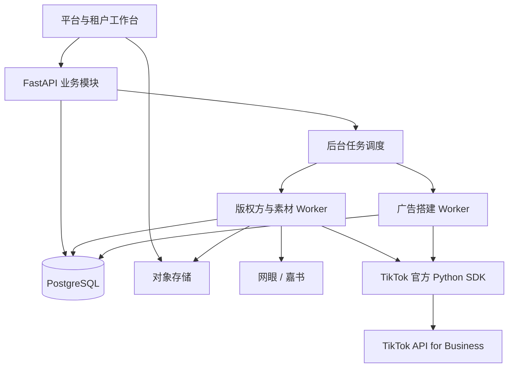

# TikTok 短剧自动投放系统：整体设计

日期：2026-09-08  
状态：已于 2026-09-08 经用户确认，作为本组实施计划的设计依据。  
设计产物：一份整体设计、五份功能设计，以及一份跨模块前端页面与交互设计。实施安排见[交付总计划与七阶段索引](../plans/2026-09-08-tiktok-00-delivery-roadmap.md)。

前端设计覆盖说明：上述确认涵盖业务规则、功能边界和技术架构。本轮已补充[前端页面与交互设计](2026-09-08-tiktok-06-frontend-experience-design.md)、五份功能文档中的页面细节，以及[可点击原型](../prototypes/2026-09-08-tiktok-workbench.html)，视觉设计与三步搭建主流程已于2026-09-09经用户确认，作为前端实施基线。七阶段计划已按页面与状态映射，详细交互在各阶段实现和验收中核对。

## 1. 产品目标与当前范围

建设独立的 TikTok 多租户短剧投放工具。平台人员可切换租户开展业务，租户人员操作自己的资源。主要工作是批量粘贴剧目与账户、自动取链、按剧名匹配素材、按策略生成广告并直接以启用状态创建。

当前范围包括租户与授权账户、版权方取链、素材上传及跨账户分发、投放策略、批量搭建预览、任务执行及失败恢复。大量账户接入和批量操作从第一版考虑，账户数量不设几十或几百的业务上限。

投放报表的数据同步、刷新频率、收入核算、分析数据库选型和自动调价暂时后置。本稿不将 ClickHouse 或报表采集系统列为当前必需基础设施。创建结果的回读、素材可用性检查和授权账户发现属于当前搭建链路。

## 2. 已确认的业务决定

| 主题 | 已确认规则 |
| --- | --- |
| 文档交付 | 一份整体设计、多份功能设计、多份实施计划；各层相互引用 |
| 租户管理 | 平台管理员切换租户，复用同一套投放工作台 |
| 租户内权限 | 不按投手划分广告账户范围；操作人保留用于审计和后续统计 |
| TikTok 接入 | 直接使用官方 SDK；后端路线采用 FastAPI，使用官方 Python SDK |
| 应用申请 | 当前没有开发者应用；先交付部署地址和授权回调，再完成应用申请与联调 |
| 账户规模 | 接入 BC 下全部有权限接入的账户，按大量账户设计 |
| 版权方 | 网眼、嘉书首先接入，各租户独立获取；后续可以增加版权方 |
| 推广链接 | 同租户、版权方连接、应用、剧目及推广配置复用已有链接 |
| 素材上传 | 本地批量上传，上传时不识别或绑定剧目 |
| 素材命名提示 | 文件名需要包含完整剧目名称 |
| 上传账户 | 系统从租户授权账户中指定，不要求用户配置；逐次记录实际上传账户 |
| 素材匹配 | 广告搭建时，根据剧名在文件名中进行包含匹配 |
| 素材分组 | 文件名排序，按策略的每组数量依次拆分，保留最后不足数量的一组 |
| 搭建输入 | 剧目和账户使用批量粘贴；策略和版权方连接可以选择 |
| 账户铺设 | 所有输入剧目铺到同一批输入账户；不采用滑动轮转或账户窗口 |
| 广告结构 | 每个“剧目 × 账户”创建一个 Campaign；每个素材组对应一个 Ad Group |
| SP 创意 | 每个 Ad Group 创建 N 条普通 Smart+ Ad，命名为 SP1～SPN；相同素材、不同文案 |
| 文案与 CTA | 预置 100 条英文通用文案，随机抽取；CTA 使用场景支持的官方候选或动态组合 |
| 预算 | Campaign 日预算，组内多个 Ad Group 共享，不随素材组数或 SP 数自动倍增 |
| 出价 | 目标 ROAS，具体数值在策略模板中填写 |
| 异常项 | 可以明确提交已经就绪的部分，保留其他异常项 |
| 创建状态 | Campaign、Ad Group、Ad 创建时直接使用 ENABLE |
| 执行恢复 | 保留成功对象，只补缺失步骤；创建结果未知时先回读核实 |

这些决定用于新工具。历史 skill 中固定账户、轮转、固定 SP 数量及先停用再启用等规则，不作为新系统默认值；本轮不修改原有 skill 或历史批次工具。

## 3. 技术架构

采用模块化后端，Web API 与后台 Worker 独立运行。模块按职责拆分，保持一套业务模型和明确的调用边界。

| 层次 | 当前选择 | 职责 |
| --- | --- | --- |
| 工程基础 | FastAPI 官方全栈模板 | 登录、开发环境、接口客户端生成、测试与部署基础 |
| 前端 | React、TypeScript、Vite、shadcn/ui、TanStack | 批量输入、预览表格、素材列表、任务进度 |
| 后端 | FastAPI、Pydantic | 租户校验、业务规则、预览和任务提交 |
| 业务数据库 | PostgreSQL | 资源目录、策略版本、快照、业务状态与执行记录 |
| 后台任务 | Celery、Redis | 取链、视频入库、素材分发、广告创建和结果检查 |
| 文件存储 | 对象存储 | 原始视频和必要的中间文件，按租户限制访问 |
| TikTok | 官方 Python SDK | 授权、账户与资产读取、素材和广告接口调用 |
| 版权方 | 网眼、嘉书各自的接入模块 | 复用已有 CLI 的接口知识，显式传入租户连接 |

官方全栈模板已包含 React、shadcn、PostgreSQL 和自动生成的前端客户端，但模板本身不提供本项目的多租户与广告业务模型。[官方模板](https://github.com/fastapi/full-stack-fastapi-template)

TikTok SDK 负责接口通信。系统保留必要的租户凭据选择、权限校验、错误归类和任务记录；不建设自研 HTTP 客户端或 MCP 替代实现。SDK 目录已经包含 Smart+ 三层对象的创建、查询与状态操作，以及视频上传和素材共享；Minis 的具体参数、应用权限和限额纳入真实联调验收。[官方 Python SDK](https://github.com/tiktok/tiktok-business-api-sdk/blob/main/python_sdk/README.md)

## 4. 功能边界与文档

| 模块 | 负责内容 | 功能设计 |
| --- | --- | --- |
| 租户与账户 | 成员角色、平台切换租户、OAuth、BC 与账户目录、权限状态 | [01 租户与账户](2026-09-08-tiktok-01-tenants-accounts-design.md) |
| 版权方与链接 | 租户连接、应用、剧目解析、推广链接复用与创建 | [02 版权方与链接](2026-09-08-tiktok-02-provider-links-design.md) |
| 素材中心 | 上传、文件信息、账户资产记录、检索、分发与可用性 | [03 素材中心](2026-09-08-tiktok-03-materials-design.md) |
| 投放策略 | 命名、预算、ROAS、分组、SP 数量、通用文案与 CTA 规则 | [04 投放策略](2026-09-08-tiktok-04-strategies-design.md) |
| 广告搭建 | 批量输入、资源准备、预览、冻结、直接启用创建、任务恢复 | [05 广告搭建与执行](2026-09-08-tiktok-05-build-execution-design.md) |

公共约束由本稿定义，各功能设计细化本模块行为。素材模块不维护永久剧目关系；搭建模块持有本次匹配和分组结果。取链可能产生版权方写操作，由资源准备任务完成；确定性计划生成器只消费准备结果，不创建外部资源。

本稿统一采用 `/api/tenants/{tenant_id}/...` 作为租户业务接口前缀，平台管理使用 `/api/platform/...`。路径中的租户 ID 必须由后端校验当前成员关系或平台权限，不能直接作为授权依据。授权回调为 `/api/integrations/tiktok/callback`，通过一次性 state 恢复发起时的租户上下文。

## 5. 核心数据关系

- **租户、成员与外部连接**：登录用户通过成员关系进入租户；平台管理权限单独识别。一个租户的数据模型允许连接多个 BC，一次上传或搭建使用明确的 BC 范围。
- **BC 与账户**：账户目录保存实际外部 ID、授权关系、币种、时区及可用状态。ID 按字符串存储，避免长数字精度丢失。授权可见与允许操作分别校验。
- **版权方连接、剧目与链接**：剧目身份包含版权方及连接/应用范围，不能只凭剧名或某个外部整数 ID 全局去重。链接保存来源返回的原始归因信息。
- **素材与账户资产**：素材记录保存租户、原文件名及文件信息；账户资产记录保存某次入库/分发的实际账户、VID/MID、封面和状态。一份素材可以有多个账户资产记录，原始素材表不绑定剧目。
- **策略及版本**：每次保存形成可追溯版本；搭建快照保存使用的具体版本和展开值，不跟随以后修改。
- **搭建批次与明细**：一次提交对应一个批次；一个“剧目 × 账户”对应一个搭建明细，下面保存素材组、SP 文案、SDK 请求配置及逐步执行结果。
- **通用文案与随机结果**：100 条英文文案属于平台预置资源；实际选中的文本与 CTA 配置进入本次快照，不能只保存一个会变化的文案库引用。

普通业务表、文件访问、任务、缓存和日志均携带租户范围。平台人员代操作仍保留真实身份，不模拟为某个租户成员。

## 6. 完整搭建流程

1. 用户进入租户及 BC 的业务范围，选策略、版权方连接和对应应用。
2. 在两个多行输入框中粘贴剧名和账户 ID/完整账户名称；空行清理，重复项合并，保留原始行号供纠错。
3. 系统解析剧目、校验账户、回查或获取链接，并在当前租户素材库按剧名检索文件。
4. 素材按文件名排序后分组，所有剧目使用同一批账户展开；每个素材组生成 N 个 SP 变体。
5. 预览展示名称、账户、素材、预算、ROAS、SP 文案、CTA、预计对象数量及异常原因。用户可调整素材；计划变更后重新形成预览版本。
6. 用户提交“创建并启用”。如果存在异常，提交区域明确展示本次实际就绪范围、排除项及配置预算合计，用户可以先提交就绪部分。
7. Worker 按素材实际来源账户完成目标账户分发与回查，然后依次创建 Campaign、Ad Group、Ad，创建参数均为 ENABLE。
8. 每一步立即保存远端 ID 和结果。回读展示真实状态与不一致项；它不构成启用前置审批，也不另设启用中心。
9. 失败明细保留。已成功的广告继续保留，后续仅补缺失步骤；状态未知的创建请求先核实远端结果。

操作状态、平台审核状态与任务执行状态分别展示。ENABLE 不是“已通过审核”或“已经开始消耗”的同义词。系统不因批次内其他明细失败而自动暂停、删除已经成功创建的广告。

## 7. 数量、预算与快照约束

设去重后有效账户数为 A，某部剧最终参与搭建的素材数为 M，每组素材数为 K，创意数量为 N：

- 该剧素材组数 G = ceil(M / K)，M 为 0 时属于未就绪，不创建空广告结构。
- 该剧在全部账户创建 A 个 Campaign、A × G 个 Ad Group、A × G × N 条 Ad。
- 不同剧目素材组数可以不同；整批数量按各剧实际展开结果求和。
- 每个 Campaign 使用策略给出的日预算，素材组数和 SP 数量不再乘预算。
- 全部 Campaign 使用同一币种与预算 B 时，整批配置日预算合计为 Campaign 数量 × B；部分就绪提交按实际提交明细计算。

例如 10 部剧铺 10 个账户，每部剧 30 条素材，每组 10 条、创意数量 2：全部就绪时为 100 个 Campaign、300 个 Ad Group、600 条 Ad。该例用于理解展开规则，不构成容量承诺。

快照覆盖输入范围、链接及归因名、账户币种、策略参数、素材组、SP 文案、CTA 选择和最终名称。创建过程中仅补充回查得到的账户素材映射及远端对象 ID；不得静默换素材、改文案或改变预算。

## 8. 大量账户与可靠执行

- 账户目录、素材列表、搭建预览和任务明细均采用服务端查询与分页，避免浏览器及单个请求加载全部数据。
- 批次按明细和步骤持久化、分批展开与执行，避免一个巨大 JSON 或一个运行到结束才保存结果的任务。
- 素材处理和广告创建可以使用不同 Worker 资源。按租户分配合理的并发机会，限流规则按应用和实际接口约束配置，不写死未经核实的 QPS。
- PostgreSQL 保存业务事实与执行步骤，Celery 负责调度。重复投递不会自动产生第二份业务提交。
- 创建超时或连接中断意味着结果未知；按已有 ID、批次名称及已记录请求核查。无法可靠判断是否已创建时，进入待核实状态，不直接重放创建。
- 同一批次的重试复用快照；“复制为新批次”是新的提交，应重新预览并产生独立批次标识。
- 当前的容量验收关注大量账户目录、预览展开、任务积压与恢复，不包括后置的报表吞吐或实时性承诺。

Celery 的重试需要业务幂等配合；其普通任务限流按 Worker 实例生效，因此系统需要统一考虑所有实例的调用额度。[Celery 任务机制](https://docs.celeryq.dev/en/stable/userguide/tasks.html)

## 9. 首版默认规则（随本组设计确认）

以下补充方案已随本组书面设计经用户确认，作为首版实施默认值；后续变更需同步更新设计与对应计划。

| 项目 | 本稿采用的建议 |
| --- | --- |
| 初始角色 | 平台管理员、租户管理员、投手、只读成员；首版采用固定权限表 |
| 租户开通 | 平台管理员创建租户并指定首位租户管理员，不开放自助注册租户 |
| 同账户跨租户冲突 | 目录保留可见账户及冲突状态；平台处理归属前，不向第二租户开放业务使用 |
| 素材检索细节 | 仅忽略大小写和剧名首尾空白，进行完整剧名字面包含；不引入翻译、别名或模糊规则 |
| 稳定排序 | 按文件名升序，同名以素材 ID 稳定排序；本次分组以快照为准 |
| 文件保留 | 首版保留原始文件与账户资产映射，不自动过期或开放物理删除，以支持失败恢复 |
| 文案抽样范围 | 每个剧目素材组抽取 N 条不同英文文案，本批次该素材组在所有账户复用同组抽样结果 |
| 命名默认 | 版权方归因基础名保持原样；后接日期和批次短码，广告组再加组号，广告再加 SP 序号 |
| 命名可配范围 | 提供可编辑后缀模板和变量，受保护的归因基础名不允许随意改写 |
| 预算币种 | 策略明确预算币种，目标账户不匹配时显示异常，不自动换汇 |
| 新批次重复投放 | 有意重复搭建通过新批次完成，不用历史同剧广告阻止正常新投放 |

## 10. 文档与实施计划的关系

整体设计及五份功能设计已完成审阅。实施计划按可独立验收的阶段拆分，不要求一份功能设计只能对应一份计划；详见[交付总计划](../plans/2026-09-08-tiktok-00-delivery-roadmap.md)。

建议的依赖顺序为：工程基础与回调地址 → 租户和账户接入 → 版权方与素材 → 策略和预览 → 真实搭建与故障恢复。版权方与素材两条功能线可以在租户边界稳定后并行推进。

实施计划将明确任务、文件、数据库迁移、接口联调、测试与验收。开发者应用申请由基础地址交付后启动，真实广告联调依赖应用与相应权限就绪。此前可以验证页面、确定性计划生成和模拟接口流程，不能将模拟通过当成真实 SDK 联调完成。

当前文档保存于现有资料目录的 `docs/superpowers/specs/`。实施计划采用独立应用目录 `/Users/yaotingfeng/Documents/ytf/tiktok-ad-automation`；本轮只形成文档，不初始化项目、安装依赖或修改投放脚本。

## 11. 整体验收原则

1. 租户隔离贯穿页面请求、版权方连接、素材、账户与后台任务；平台代操作可追溯。
2. 批量粘贴完成剧目与账户输入，不要求再次逐项勾选，不出现滑动轮转。
3. 上传无需识别剧目或配置素材账户；实际来源账户始终可追踪。
4. 分组、N 个 SP、Campaign 预算和目标 ROAS 的展开结果与预览一致。
5. 相同取链配置可复用链接；版权方归因信息未被命名模板改写。
6. 三层对象的创建请求直接 ENABLE；没有停用创建再开启的默认流程。
7. 部分就绪提交和部分失败均有明确范围；重复提交与恢复不会盲目重复创建。
8. 大量账户下目录及预览可分页，后台可持续处理并恢复；真实容量以专项测试结果记录。

## 12. 本地参考资料

- [已有 TikTok 建设方案](/Users/yaotingfeng/Documents/ytf/ytf-os-ad-skill/TikTok%20AD/TikTok%20漫剧广告投放工具建设方案.md)：作为历史架构参考，其账户、状态和数据范围由本轮决定覆盖。
- [现有 TikTok skill](../../../.codex/skills/tiktok-smart-plus-drama-ads/SKILL.md)：参考接口经验、素材回查和台账机制，不继承固定批次规则。
- [嘉书 CLI 文档](/Users/yaotingfeng/Documents/ytf/ytf-os-ad-skill/TikTok%20AD/jiashu-drama-link-tool/README.md)：参考多账号、应用发现与取链协议。
- 巨量参考项目：`/Users/yaotingfeng/Documents/ytf/ytf-ad-skill/ad_automation`，借鉴预览快照和任务恢复经验，领域对象按 TikTok 重新设计。
