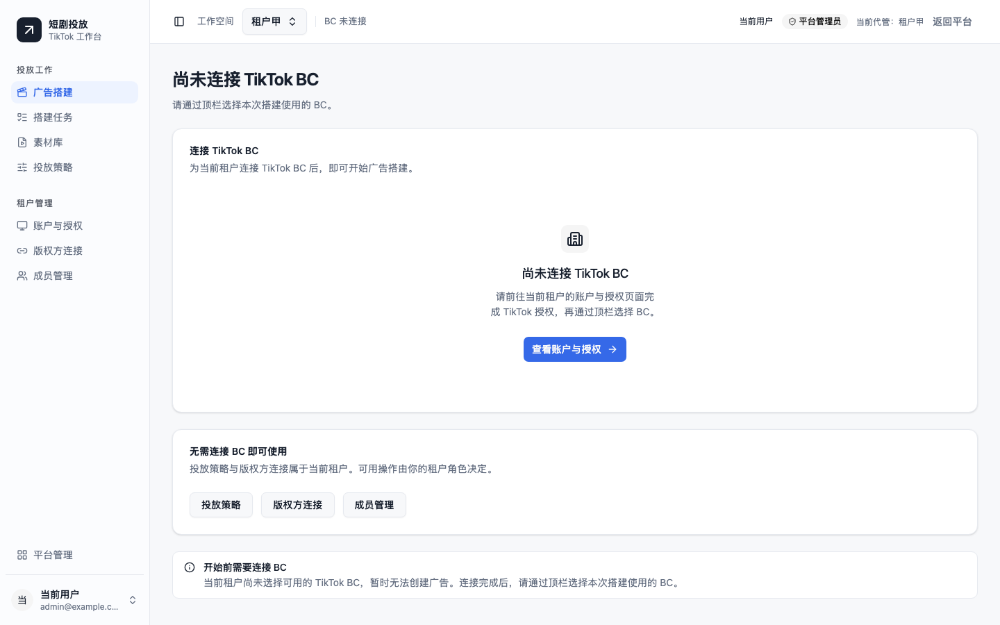

# 本地目录迁移与首次使用验收

日期：2026-09-09。用户反馈代码不在当前资料工作区，且平台管理员登录后多项菜单点击没有效果。本次据此补做实际入口验收；此前离线套件通过不能证明首次使用没有交互问题，更不代表真实投放已通过验收。

## 目录与运行状态

应用已实际迁入 `/Users/yaotingfeng/Documents/ytf/ytf-os-ad-skill/projects/tiktok-ad-automation/`，保留独立 Git 仓库与 `git@github.com:yaotingfeng/tiktok-ad-automation.git`，不是指向旧目录的快捷链接。旧目录不再用于运行。

迁移前正常停止 API、Worker、Beat、PostgreSQL 和 Redis，保存 Redis 快照。迁移后修复 Git worktree 元数据和绝对链接，重建主 `.venv`，从新目录恢复服务。独立只读复核确认 Git 历史、editable app 路径、服务工作目录、数据库迁移 `0014_recovery_candidates`、原用户与租户以及 Redis 均正常，私有配置仍未纳入 Git。

## 修正的页面问题

- 平台范围原本展示 `/strategies` 等不带租户的菜单，点击又被路由送回平台首页。现在平台首页明确要求从租户列表“进入租户”，进入后才显示该租户的业务菜单，不自动选取第一个租户。
- 素材、任务、草稿及预览的空态原本漏传租户上下文，错误显示“尚未接入租户”。现在区分没有 BC 和资源所属 BC 不一致，后一种情况可以切回资源实际所属 BC。
- 没有 BC 时，页面仍提供该租户的策略与版权方入口；成员入口按管理员权限显示。目的页继续执行原角色检查，缺少 App 不会被假授权绕过。

修复提交 `35a033b`（来源 `ea8d9f1`）。新增空白策略回归 `813e119`（来源 `94b3b92`）仅修改测试；原生鼠标及键盘选择币种均能正常保存，没有为浏览器检查工具的一次交互异常添加产品补丁。

## 验收证据与边界

| 验收方式 | 已核实结果 |
| --- | --- |
| 新增页面回归先失败后通过 | 复现平台菜单循环、遗漏租户上下文、缺少配置入口和 BC 不匹配文案；修复后 10 项通过 |
| 修复后的完整工作区回归 | 260 项通过，2 workers、0 retries；包括 1440/390px 与角色边界 |
| 空白策略专项 | 新增鼠标先选币种、后选币种、键盘选择三个场景；生产静态构建上的策略套件 30 项通过，校验唯一 POST 与 USD/预算/ROAS/素材组/SP 参数 |
| 主应用真实浏览器与数据库 | 在 `http://127.0.0.1:8011` 登录、进入原本地验证租户，查看修复后的平台/租户导航；实际新建“本地验收策略 20260909”，再编辑到 v2；刷新后仍为 USD 120、每组 10 条、3 条 SP，示例显示 3 个广告组 / 9 条广告 |
| 其他实际页面 | 版权方新增窗口可打开，网眼切换嘉书后字段变化正确；成员列表与新增窗口可打开并取消；搭建、素材、任务显示当前租户缺少 BC，账户页保持未配置 App 的授权限制 |
| 工程与入口 | 主目录生产构建、完整 TypeScript 检查通过；健康、静态登录、回调确定业务错误、未知 API 404 检查通过 |

本地策略是明确命名的验收记录，没有创建广告或连接真实版权方。页面回归使用 HTTP 边界替身；上表的实际浏览器操作使用普通本地 API 和数据库，不拦截业务响应。两类证据不能互相替代。

当前没有真实 App、BC 授权和外部服务联调；宿主机 `solo` Worker 仅供基础诊断，需要硬截止的业务任务必须在 Linux prefork / Compose 环境运行。因此目前可以确认上述管理页面和策略保存可操作，不能确认当前本地环境可以完成真实投放。启动方式见[部署手册](../runbooks/bootstrap-deployment.md)，外部条件见[真实联调清单](../acceptance/live-sdk.md)。

下图来自合成租户的页面回归，展示没有 BC 时仍可使用的配置入口：

